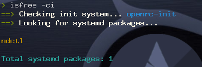

# IsFree
> FREELY making Arch Linux more free

[](https://aur.archlinux.org/packages/isfree/)
[](https://github.com/leo-arch/isfree/blob/master/LICENSE)

---

## 1. Description


This bash script is mainly intended to find out whether there is some non-free/libre package (both official and from the AUR) in your Arch Linux installation. It uses Parabola's blacklists to perform the tests. Taking advantage of these blacklists, you can also scan the system for privacy threatening software. You can check entire repos or individual packages as well. Finally, _IsFree_ includes an option (`-i`) to check your system for systemd depending packages (supporting the init freedom campaign!) Take a look at https://www.devuan.org/os/init-freedom/



Come on, give uncle RMS a smile!

---

## 2. Installation

Install _IsFree_ from the AUR: https://aur.archlinux.org/packages/isfree

Or, clone the project, cd into the `isfree` directory, compile and install with `makepkg`, and finally run the program:

```sh
git clone https://github.com/leo-arch/isfree
cd isfree
makepkg -si
isfree -h
```

---

## 3. Side note

Though `isfree` works perfectly as a standalone program, it was originally intended to work together with two other programs: `pacfree` (see https://github.com/leo-arch/pacfree) and `pacrep` (see https://github.com/leo-arch/pacrep). Take a look specially at `pacfree`, which is the head of this triad. They were all designed to make `pacman` and Arch Linux even more free.
