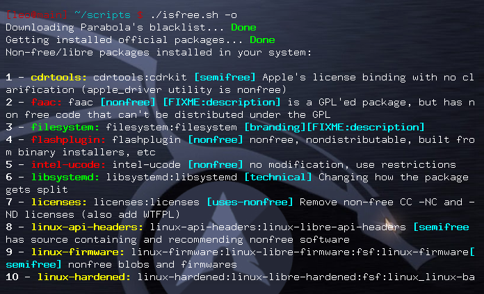

# IsFree
> FREELY making your Arch Linux free

This script is mainly intended to find out whether there is some non-free/libre package (both official and from the AUR) in your Arch Linux installation. It uses Parabola's blacklists to perform the tests. Taking advantage of these blacklists, I also added an option to scan the system for privacy threatening software. You can check entire repos or individual packages as well. Come on, give a smile to uncle RMS!

Update: Last version includes an option (-i) to check your system for systemd depending packages (supporting the init freedom campaign!) Take a look at https://www.devuan.org/os/init-freedom/

## Installation

Clone the project, cd into the isfree directory, compile and install with `makepkg`, and finally run the program:

	git clone https://github.com/leo-arch/isfree
	cd isfree
	makepkg -si
	isfree -h

## A side note

Though `isfree` works perfectly as a standalone program, it was originally intended to work together with two other programs: `pacfree` (see https://github.com/leo-arch/pacfree) and `pacrep` (see https://github.com/leo-arch/pacrep). Take a look specially at `pacfree`, which is the head of this triad. They were all designed to make `pacman` and Arch Linux even more free.
